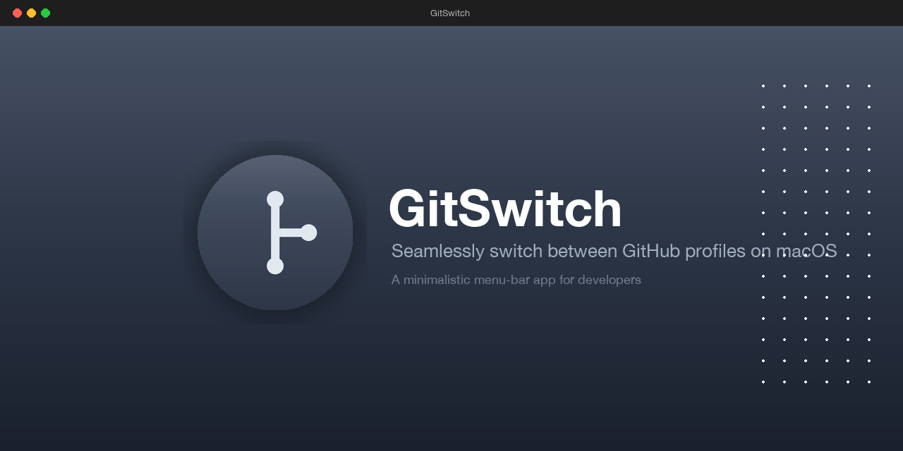
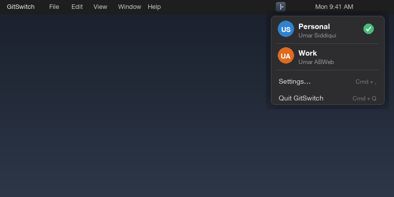
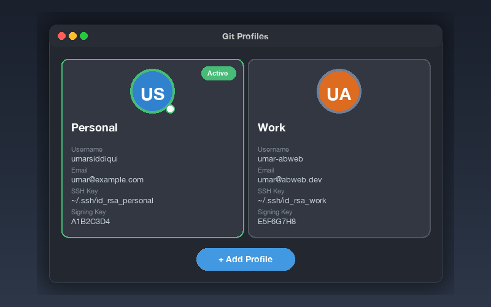

  

<h1 align="center">GitSwitch</h1>

  <b>Minimalistic macOS menu-bar app for switching between GitHub profiles</b>

  
  
  
  
  

---

## Features

- 🚀 **One-click profile switching** from the menu bar
- 🔑 **Automatic SSH key rotation** — swaps keys instantly
- ⚙️ **Global git config switching** — updates name & email automatically
- 🎨 **Minimalistic native macOS design** — feels right at home on your Mac
- 🌓 **Light & Dark mode support** — adapts to your system appearance
- 🔒 **HTTPS→SSH URL rewriting** — ensures all remotes use the right key
- ➕ **Easy profile add/edit/delete** — manage identities in seconds

## Screenshots

  
  &nbsp;&nbsp;
  

## ⭐ Star History

## Installation

1. Download `GitSwitch.app` from the [Releases](https://github.com/umarsiddiqui/GitSwitch/releases) page
2. Drag it to your **Applications** folder (or run directly from Desktop)
3. Right-click → **Open** to bypass Gatekeeper on first launch
4. Look for the indigo icon in your menu bar — you're ready to go!

> **Note:** GitSwitch requires macOS 14.0 or later.

## Usage

- **Click** the menu bar icon to see your configured profiles
- **Click** a profile to instantly switch your Git identity
- **Click** **Settings…** to add, edit, or remove profiles

### Default Profiles

| Profile | Username | Email | SSH Key |
|---------|----------|-------|---------|
| Personal | `umarsiddiqui` | `your-personal@email.com` | `~/.ssh/id_rsa_personal` |
| Work | `umar-abweb` | `your-work@email.com` | `~/.ssh/id_rsa_work` |

## How It Works

GitSwitch performs three atomic steps every time you switch profiles:

1. **Updates `~/.gitconfig`** — overwrites `user.name` and `user.email` with the selected profile's details
2. **Updates `~/.ssh/config`** — points `IdentityFile` to the correct SSH private key for that profile
3. **Runs `ssh-add`** — unloads the old key and loads the new one into the SSH agent

Optionally, it can also rewrite remote URLs from HTTPS to SSH so that all Git operations authenticate with the active key.

## Tech Stack

| Technology | Purpose |
|------------|---------|
| **Swift 5.9** | Core language |
| **SwiftUI + MenuBarExtra** | Native macOS UI |
| **Combine** | Reactive state management (`ObservableObject`) |
| **URLSession** | Future network operations |

## Contributing

Contributions are welcome! Whether it's a bug fix, a new feature, or documentation improvements — every pull request helps.

1. Fork the repository
2. Create a new branch (`git checkout -b feature/amazing-idea`)
3. Make your changes
4. Commit (`git commit -m 'Add amazing idea'`)
5. Push (`git push origin feature/amazing-idea`)
6. Open a Pull Request

Please make sure your code follows the existing style and includes appropriate tests where applicable.

## License

This project is licensed under the [MIT License](LICENSE) — see the file for details.

---

  Crafted with ☕ by <a href="https://github.com/umarsiddiqui">Umar Siddiqui</a>

